# UI/UX Exploration: ERP & Accounting Systems Analysis

This document presents a comprehensive analysis of existing ERP and accounting applications, focusing on UI/UX patterns, strengths, weaknesses, and opportunities for building a superior cold storage management system.


*Modern ERP interface design principles*

---

## Table of Contents

1. [Competitive Overview Summary](#1-competitive-overview-summary)
2. [UX/UI Pros & Cons Analysis](#2-uxui-pros--cons-analysis)
3. [Key Design & Usability Patterns](#3-key-design--usability-patterns)
4. [Pain Points & Workload Drivers](#4-pain-points--workload-drivers)
5. [Innovative UI/UX Ideas](#5-innovative-uiux-ideas)
6. [Final Recommendations](#6-final-recommendations)

**Appendices:**
- [Appendix A: Competitive Product Screenshots](#appendix-a-competitive-product-screenshots-analysis)
- [Appendix B: User Persona Considerations](#appendix-b-user-persona-considerations)
- [Appendix C: Glossary of UI/UX Terms](#appendix-c-glossary-of-uiux-terms)
- [Appendix D: Image Sources & Attribution](#appendix-d-image-sources--attribution)

---

## 1. Competitive Overview Summary

### 1.1 Major ERP/Accounting Solutions Analyzed

| Solution | Target Market | Deployment | Key Strength | Key Weakness |
|----------|--------------|------------|--------------|--------------|
| **TallyPrime** | Indian SMEs, CAs, Wholesalers | Desktop/Cloud | GST compliance, keyboard-driven efficiency | Outdated UI, steep learning curve for non-accountants |
| **Zoho Books** | Small-Medium businesses | Cloud | Modern UI, seamless integrations | Less robust inventory features |
| **Vyapar** | Micro/Small businesses | Mobile/Desktop | Simple, non-accountant friendly | Limited for complex operations |
| **Busy Accounting** | Trading/Manufacturing SMEs | Desktop | Advanced inventory, GST compliance | Complex interface, dated design |
| **QuickBooks** | Global SMBs | Cloud | User-friendly, fast onboarding | Page load issues (5-10 sec), scalability limits |
| **Odoo** | Growing businesses | Cloud/On-premise | Modular, highly extensible | Longer implementation, complexity |
| **NetSuite** | Mid-large enterprises | Cloud | Comprehensive ERP, scalability | High cost, steep learning curve |

### 1.2 Cold Storage Specific Solutions (India)

| Solution | Focus Area | Notable Features |
|----------|-----------|------------------|
| **Visual Softech (CAP)** | Agricultural cold storage | Lot tracking, rent calculation, multi-chamber management |
| **Daksh ERP** | Cold storage operations | Temperature monitoring, expiry tracking, GST billing |
| **PALMS** | Agriculture management | Commodity tracking, farmer/trader management |
| **Improsys WMS** | Warehouse management | Rack-wise location tracking, expiry dashboards |

### 1.3 Market Trends

- **Cloud adoption**: 78% of new ERP implementations are cloud-based
- **Mobile-first design**: Essential for field operations and remote access
- **AI integration**: Market projected to grow from $3.6B (2023) to $37.2B (2033)
- **Regional language support**: 88% of Indian users prefer native language interfaces
- **GST compliance**: Non-negotiable requirement for Indian business software

---

## 2. UX/UI Pros & Cons Analysis

### 2.1 TallyPrime

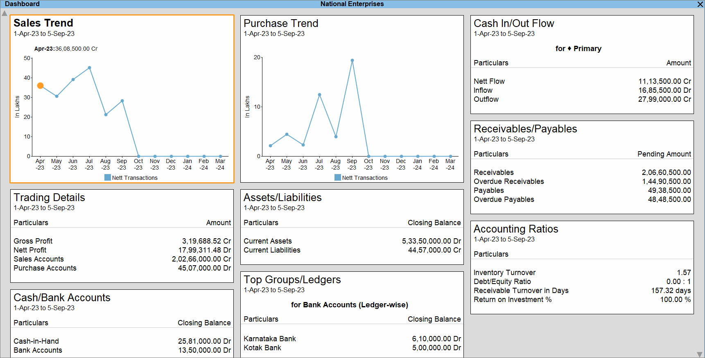
*TallyPrime's tile-based dashboard with customizable widgets*

| Aspect | Pros | Cons |
|--------|------|------|
| **Navigation** | "Go To" feature for quick access, keyboard shortcuts (F1-F8) | Menu-heavy navigation, steep initial learning |
| **Data Entry** | Fast voucher entry, auto-calculations | Dense forms, small fonts |
| **Visual Design** | Clean, functional layout | Dated aesthetic, limited customization |
| **Learning Curve** | Efficient for trained users | "Bad UI/UX for non-accountants" |
| **Reporting** | Comprehensive report generation | Complex drill-down navigation |

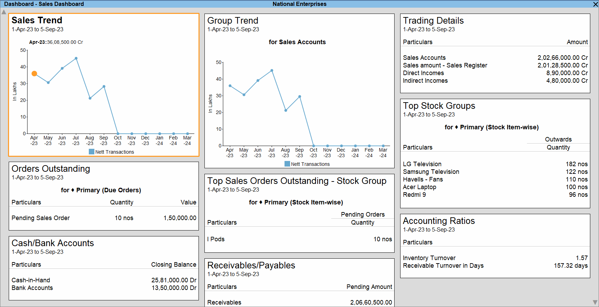
*TallyPrime's predefined sales dashboard view*

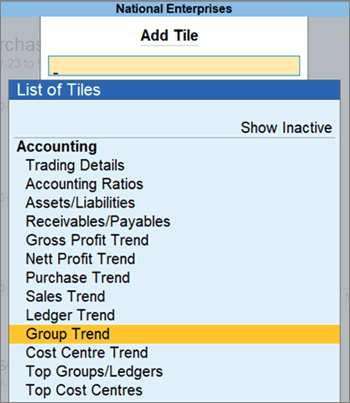
*Adding and customizing dashboard tiles in TallyPrime*

### 2.2 Zoho Books/Inventory

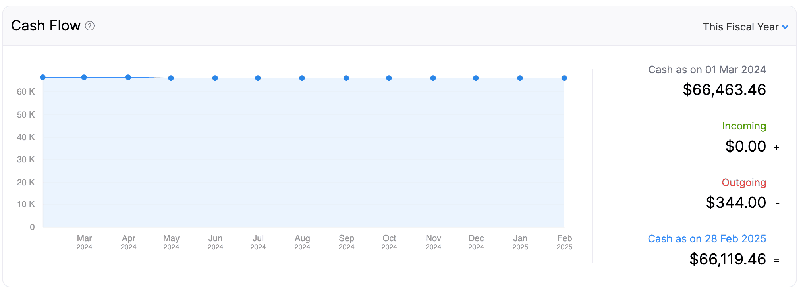
*Zoho Books cash flow visualization panel*

| Aspect | Pros | Cons |
|--------|------|------|
| **Navigation** | Intuitive sidebar, consistent across products | Can feel cluttered with many features |
| **Data Entry** | Clean forms, smart defaults | Recurring invoice setup "fiddly and over-complicated" |
| **Visual Design** | Modern, professional appearance | Color scheme may not suit all users |
| **Learning Curve** | "Learn to use it very fast" | Feature discovery can be challenging |
| **Integration** | 40+ Zoho app integrations | Lock-in to Zoho ecosystem |

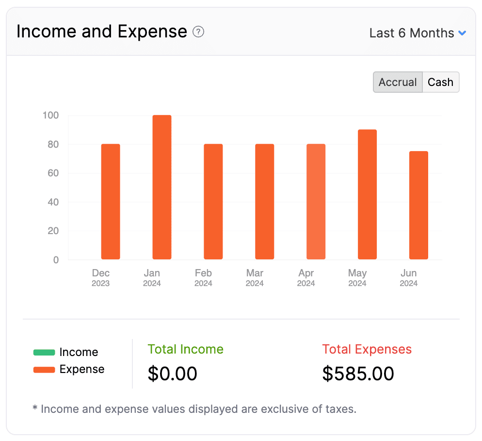
*Zoho Books income and expense tracking panel*

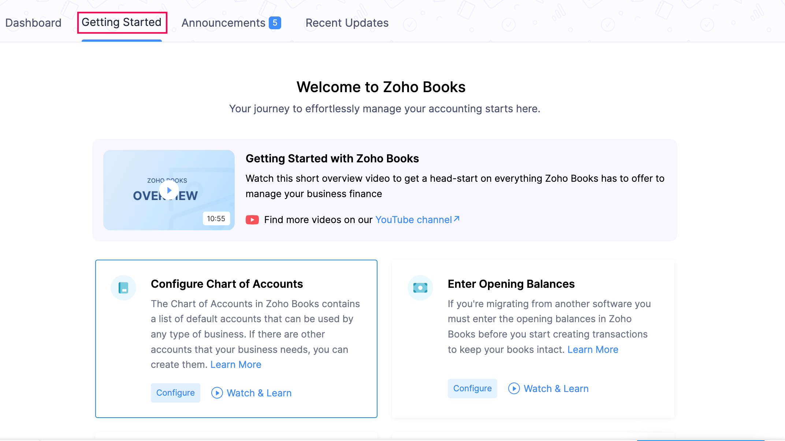
*Zoho Books onboarding experience with guided setup*

### 2.3 Vyapar


*Vyapar's mobile-first interface design*

| Aspect | Pros | Cons |
|--------|------|------|
| **Navigation** | Mobile-first, simple structure | Limited advanced features |
| **Data Entry** | Shortcut keys, barcode support, auto-fill | Basic compared to full ERPs |
| **Visual Design** | Clean, modern mobile UI | Desktop version less polished |
| **Learning Curve** | Works for non-accountants | May outgrow for larger operations |
| **Offline Support** | Full offline functionality | Sync conflicts possible |


*Vyapar's GST billing and invoicing interface*

### 2.4 QuickBooks

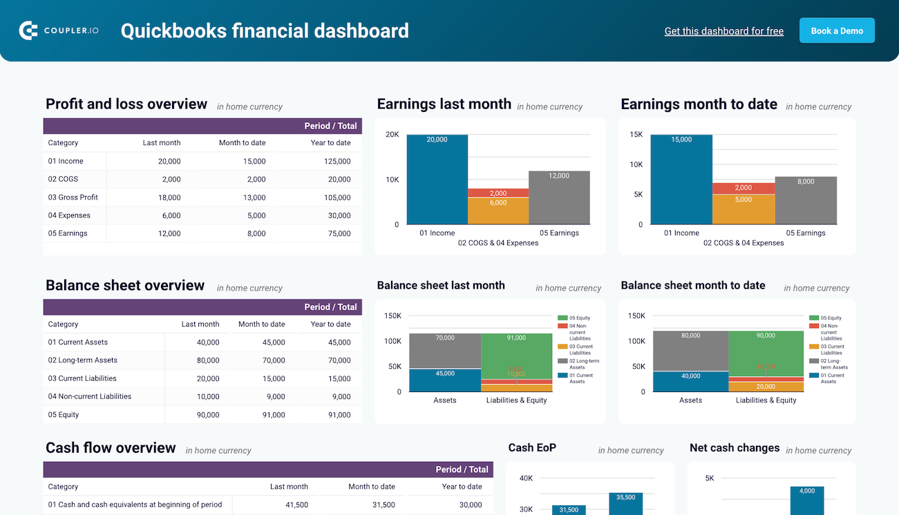
*QuickBooks financial overview dashboard with key metrics*

| Aspect | Pros | Cons |
|--------|------|------|
| **Navigation** | Intuitive dashboard, clear hierarchy | Page loads 5-10 seconds |
| **Data Entry** | Automated bank feeds, journal entries | Setup can be challenging |
| **Visual Design** | Clean, consumer-friendly | Less suited for complex inventory |
| **Learning Curve** | "Can be live in days" | Limited depth for power users |
| **Support** | Large community | Lack of direct professional support |

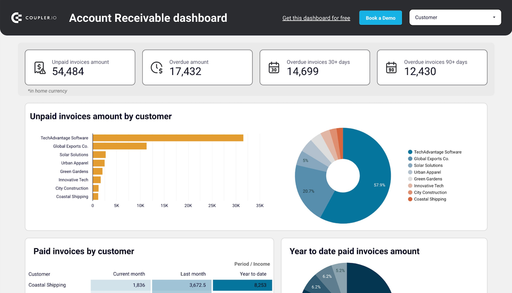
*QuickBooks accounts receivable tracking dashboard*

### 2.5 Comparison Matrix: Key UI/UX Factors

| Factor | TallyPrime | Zoho | Vyapar | QuickBooks | Odoo |
|--------|-----------|------|--------|------------|------|
| First-time usability | 2/5 | 4/5 | 5/5 | 4/5 | 3/5 |
| Power user efficiency | 5/5 | 3/5 | 2/5 | 3/5 | 4/5 |
| Mobile experience | 2/5 | 4/5 | 5/5 | 4/5 | 4/5 |
| Visual design | 2/5 | 4/5 | 4/5 | 4/5 | 4/5 |
| Customization | 3/5 | 4/5 | 2/5 | 3/5 | 5/5 |
| Regional language | 4/5 | 3/5 | 4/5 | 2/5 | 3/5 |
| Keyboard efficiency | 5/5 | 3/5 | 3/5 | 3/5 | 3/5 |

---

## 3. Key Design & Usability Patterns

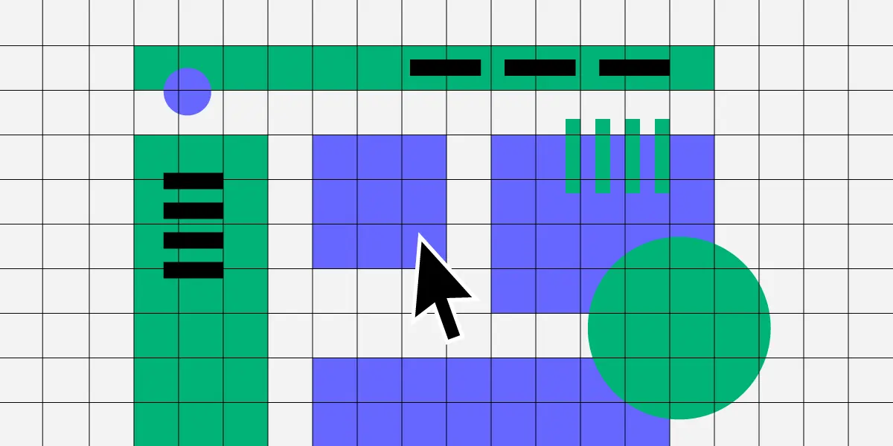
*Core principles for effective dashboard design*

### 3.1 Effective Patterns (To Adopt)

#### A. Dashboard Design Patterns


*Example of an analytical dashboard with clear data visualization*

| Pattern | Description | Example |
|---------|-------------|---------|
| **Inverted Pyramid** | Critical KPIs at top, details on drill-down | NetSuite executive dashboard |
| **F-Pattern Layout** | Important metrics top-left, following eye movement | Zoho Books dashboard |
| **Role-Based Views** | Different dashboards per user role | Odoo's configurable home |
| **Bento Grid Layout** | Modular, reorganizable widgets | Modern SaaS dashboards |
| **Real-Time Indicators** | Live updates for critical metrics | Temperature alerts, stock levels |

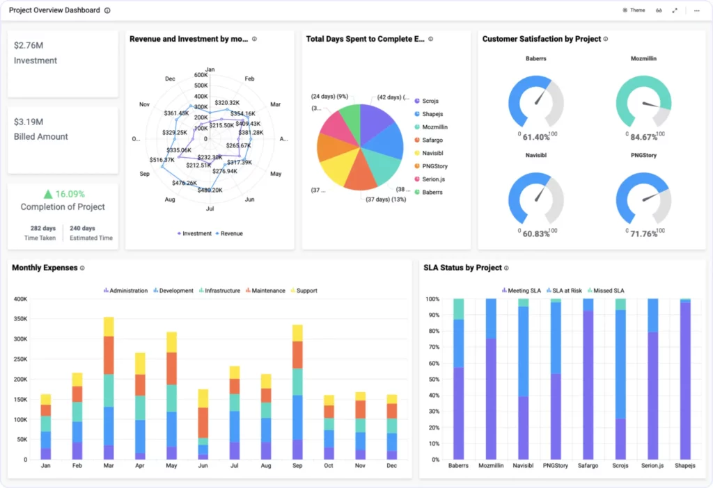
*Operational dashboard design for real-time monitoring*

#### B. Navigation Patterns

| Pattern | Description | Benefits |
|---------|-------------|----------|
| **Global Search ("Go To")** | Search anything from anywhere | Reduces clicks, TallyPrime's best feature |
| **Contextual Sidebar** | Actions relevant to current screen | Reduces context switching |
| **Breadcrumb Navigation** | Clear path showing current location | Helps orientation in deep hierarchies |
| **Quick Actions Bar** | Frequently used actions always visible | One-click access to common tasks |
| **Keyboard Shortcuts** | Function keys for common operations | Power user efficiency |

#### C. Data Entry Patterns

| Pattern | Description | Benefits |
|---------|-------------|----------|
| **Smart Autocomplete** | Suggests recent/frequent entries | Reduces typing, prevents errors |
| **Inline Validation** | Real-time error feedback | Prevents submission failures |
| **Progressive Disclosure** | Show advanced options only when needed | Reduces cognitive load |
| **Autofill from History** | Pre-populate based on past transactions | Speed, consistency |
| **Tab Navigation** | Logical field order with Tab key | Keyboard-only data entry |

#### D. Feedback Patterns

| Pattern | Description | Benefits |
|---------|-------------|----------|
| **Success Confirmations** | Clear feedback after actions | Confidence in task completion |
| **Undo Capability** | Reverse recent actions | Reduces fear of mistakes |
| **Live Calculations** | Show totals as user types | Immediate verification |
| **Warning Before Destructive Actions** | Confirmation dialogs | Prevents accidental data loss |

### 3.2 Problematic Patterns (To Avoid)

| Anti-Pattern | Problem | Better Alternative |
|--------------|---------|-------------------|
| **Deep Menu Hierarchies** | Users get lost, too many clicks | Flat navigation + search |
| **Modal Overload** | Interrupts flow, blocks context | Inline editing, slide-overs |
| **Dense Forms** | Overwhelming, error-prone | Grouped sections, progressive disclosure |
| **Unexplained Jargon** | Confuses non-experts | Contextual help, tooltips |
| **Full Page Reloads** | Slow, loses context | SPA architecture, partial updates |
| **Excessive Dropdowns** | Halts user flow | Autocomplete with search |
| **Tiny Click Targets** | Frustrating on touch/mobile | Minimum 44px touch targets |
| **No Keyboard Support** | Slows power users | Full keyboard navigation |

### 3.3 Industry-Specific Patterns (Cold Storage)


*Cold storage warehouse management system - Expiry tracking dashboard*

| Pattern | Application | Implementation |
|---------|-------------|----------------|
| **Visual Room Map** | Show storage layout | Interactive floor plan with occupancy |
| **Lot Timeline** | Track lot history | Visual timeline from Amad to Nikasi |
| **Alert Dashboard** | Temperature, expiry, overdue | Color-coded priority cards |
| **Party Quick View** | See party details in context | Hover/click card with balance, stock, contact |
| **Barcode/QR Integration** | Quick lot lookup | Camera-based scanning |


*Inventory tracking interface for cold storage operations*


*Real-time temperature monitoring interface*


*Cold storage billing configuration interface*

---

## 4. Pain Points & Workload Drivers

### 4.1 Universal ERP Pain Points

| Category | Pain Point | User Impact | Frequency |
|----------|-----------|-------------|-----------|
| **Complexity** | Too many features visible | Cognitive overload, errors | Very High |
| **Navigation** | Multiple clicks for common tasks | Time waste, frustration | Very High |
| **Data Entry** | Repetitive manual input | Fatigue, errors | Very High |
| **Learning** | Steep learning curve | Low adoption, resistance | High |
| **Search** | Hard to find information | Lost time, missed data | High |
| **Mobile** | Poor mobile experience | Can't work remotely | Medium |
| **Speed** | Slow page loads | Lost productivity | Medium |
| **Reporting** | Complex report generation | Delayed decisions | Medium |
| **Integration** | No connection to other tools | Duplicate data entry | Medium |
| **Support** | Inadequate help/documentation | Stuck users | Medium |

### 4.2 Cold Storage Specific Pain Points

| Pain Point | Current State | User Impact |
|------------|---------------|-------------|
| **Lot Management** | Manual tracking, paper-based | Lost lots, incorrect billing |
| **Rent Calculation** | Complex rules, manual computation | Errors, disputes |
| **Party Communication** | Separate phone calls, no tracking | Missed updates, complaints |
| **Balance Reconciliation** | Manual ledger comparison | Time-consuming, errors |
| **Seasonal Settlement** | Massive end-of-season workload | Stress, delays, errors |
| **Hindi Input** | Clunky on-screen keyboards | Slow data entry |
| **Multi-Party Deals** | Tracking Kissan-Vyapari-Agent relationships | Confusion, disputes |
| **Transport Tracking** | Manual chitti management | Lost records, delayed payments |

### 4.3 Workload Analysis by Task

| Task | Current Clicks | Time (avg) | Frustration Level |
|------|---------------|------------|-------------------|
| Create new party | 15-20 clicks | 5-8 min | Medium |
| Record stock arrival (Amad) | 12-15 clicks | 3-5 min | Medium |
| Create voucher | 8-10 clicks | 2-3 min | Low |
| Generate party ledger | 6-8 clicks | 1-2 min | Low |
| Search for lot | 5-10 clicks | 1-3 min | Medium |
| End-of-day summary | 10-15 clicks | 5-10 min | High |
| Seasonal settlement (per party) | 20-30 clicks | 10-15 min | Very High |
| Bardana adjustment | 10-12 clicks | 3-5 min | High |

### 4.4 Cognitive Load Factors

| Factor | Description | Mitigation Strategy |
|--------|-------------|---------------------|
| **Too many visible options** | User doesn't know where to start | Role-based, contextual UI |
| **Unfamiliar terminology** | Accounting jargon confuses | Plain language + tooltips |
| **Complex relationships** | Kissan→Lot→Vyapari→Chitti chain | Visual workflow guides |
| **Mental calculations** | Figuring out balances, dates | Auto-calculations, summaries |
| **Context switching** | Jumping between screens | Split views, inline details |
| **Error anxiety** | Fear of making mistakes | Undo, validation, confirmations |

---

## 5. Innovative UI/UX Ideas

### 5.1 Smart Dashboard Concepts

#### A. Adaptive Home Dashboard
```
┌─────────────────────────────────────────────────────────┐
│  Good Morning, [User]          🔔 3 Alerts  📅 Today    │
├─────────────────────────────────────────────────────────┤
│  ┌─────────────┐ ┌─────────────┐ ┌─────────────────────┐│
│  │ TODAY'S     │ │ PENDING     │ │ QUICK ACTIONS       ││
│  │ ARRIVALS    │ │ DISPATCHES  │ │ ┌─────┐ ┌─────┐     ││
│  │    12       │ │     8       │ │ │+Amad│ │+Chit│     ││
│  │ lots        │ │ saudas      │ │ └─────┘ └─────┘     ││
│  └─────────────┘ └─────────────┘ │ ┌─────┐ ┌─────┐     ││
│  ┌─────────────┐ ┌─────────────┐ │ │Vouch│ │Ledgr│     ││
│  │ OVERDUE     │ │ STOCK VALUE │ │ └─────┘ └─────┘     ││
│  │ PAYMENTS    │ │             │ └─────────────────────┘│
│  │  ₹2.4L      │ │   ₹45L      │                        │
│  │  15 parties │ │  2340 qtl   │                        │
│  └─────────────┘ └─────────────┘                        │
├─────────────────────────────────────────────────────────┤
│  🌡️ TEMPERATURE ALERTS                                  │
│  Room 3: 6.2°C (⚠️ High) | Room 7: 4.1°C (✓ Normal)    │
├─────────────────────────────────────────────────────────┤
│  📋 RECENT ACTIVITY                         [View All →]│
│  • Amad: Ram Singh - 45 bags POTATO - Room 5 (2 min ago)│
│  • Payment: ₹25,000 received from Sharma Traders        │
│  • Chitti #1234 generated for Lot #5678                │
└─────────────────────────────────────────────────────────┘
```

#### B. Contextual Party Card (Hover/Click Expansion)
```
┌────────────────────────────────────────┐
│ 👤 Ramesh Kumar S/O Bhagwan Das        │
│    📍 Shamli, UP  📱 9876543210        │
├────────────────────────────────────────┤
│ BALANCE        │ STOCK         │ DEALS │
│ ₹45,230 Dr     │ 234 bags      │ 3     │
│                │ 58.5 qtl      │pending│
├────────────────────────────────────────┤
│ [📄 Ledger] [📦 Stock] [💳 Payment]   │
│ [📝 New Sauda] [🧾 Chitti]            │
└────────────────────────────────────────┘
```

### 5.2 Workflow Simplification Ideas

#### A. One-Click Quick Entry Mode
Instead of navigating to forms, provide a command palette (Ctrl+K):
```
┌────────────────────────────────────────────────────────┐
│ 🔍 What would you like to do?                          │
│ ┌────────────────────────────────────────────────────┐ │
│ │ amad ramesh potato 50 bags room 5                  │ │
│ └────────────────────────────────────────────────────┘ │
│                                                        │
│ SUGGESTED ACTIONS:                                     │
│ 📦 Record Amad for "Ramesh Kumar" - POTATO            │
│    50 bags → Room 5                                    │
│                                                        │
│ Press Enter to confirm, Tab to modify                  │
└────────────────────────────────────────────────────────┘
```

#### B. Smart Form Auto-Fill
When selecting a party, auto-populate based on history:
- Last commodity stored
- Preferred room allocation
- Standard bardana type
- Default rates from party profile

#### C. Batch Operations
Enable multi-select for common operations:
```
┌─────────────────────────────────────────────────────────┐
│ ☑ Selected: 5 parties                    [Apply Action ▼]│
├─────────────────────────────────────────────────────────┤
│ ☑ Ramesh Kumar        ₹12,000 Dr    │ Generate Statement│
│ ☑ Suresh Traders      ₹8,500 Dr     │ Send SMS Reminder │
│ ☑ Mohan Singh         ₹45,000 Dr    │ Calculate Interest│
│ ☑ Sharma Cold         ₹3,200 Cr     │ Export to Excel   │
│ ☑ Agarwal & Sons      ₹67,000 Dr    │ Print All Ledgers │
└─────────────────────────────────────────────────────────┘
```

### 5.3 Reducing Clicks - Before & After

#### Task: Record Stock Arrival (Amad)

**Current Flow (12-15 clicks):**
1. Click sidebar menu
2. Click "Inward"
3. Click date picker
4. Select date
5. Click party field
6. Type/search party name
7. Select party
8. Click commodity dropdown
9. Select commodity
10. Click room dropdown
11. Select room
12. Enter lot number
13. Enter packets
14. Enter weight
15. Click Save

**Proposed Flow (5-7 actions):**
1. Press Ctrl+A (Quick Amad shortcut)
2. Start typing party name (auto-focus, auto-complete)
3. Tab → auto-suggests last commodity + room
4. Tab → enter packets
5. Tab → enter weight (auto-calculates from packets if standard)
6. Enter to save (auto-generates lot number)

### 5.4 Visual Workflow Guides

#### Transaction State Visualization
```
SAUDA LIFECYCLE:
┌──────────┐    ┌──────────┐    ┌──────────┐    ┌──────────┐
│ CREATED  │───→│ PENDING  │───→│ EXECUTED │───→│ SETTLED  │
│ (Draft)  │    │ (Active) │    │ (Chitti) │    │ (Paid)   │
└──────────┘    └──────────┘    └──────────┘    └──────────┘
                     │                │
                     ↓                ↓
              ┌──────────┐     ┌──────────┐
              │ CANCELLED│     │ PARTIAL  │
              └──────────┘     └──────────┘
```

### 5.5 Mobile-First Features

#### A. Scan-to-Action
- Scan QR code on lot label → View lot details + quick actions
- Scan party card → Open party profile with stock/balance
- Scan chitti → Track delivery status

#### B. Voice Input for Hindi Names
- Tap microphone icon
- Speak party name in Hindi
- System transcribes and matches

#### C. Offline-First with Smart Sync
- All core operations work offline
- Automatic background sync when connected
- Conflict resolution with clear UI

### 5.6 AI-Powered Suggestions

| Feature | Description | User Benefit |
|---------|-------------|--------------|
| **Smart Defaults** | Suggest commodity/room based on party history | 50% fewer selections |
| **Anomaly Alerts** | Flag unusual transactions | Prevent errors |
| **Payment Predictions** | Suggest likely payment amounts | Faster data entry |
| **Next Action Hints** | "You usually generate chitti after this" | Workflow guidance |
| **Balance Insights** | "Payment from this party is 15 days overdue" | Proactive management |

### 5.7 Accessibility & Localization

#### A. Full Hindi Interface Option
- All labels, buttons, messages in Hindi (Devanagari)
- Preserve English for numbers and technical terms
- Toggle between languages instantly

#### B. Smart Hindi Input
- Phonetic typing: Type "ramesh" → रमेश
- Predictive suggestions for common names/villages
- Voice-to-text for Hindi names

#### C. High Contrast & Dark Mode
- Dark mode for reduced eye strain (long hours)
- High contrast option for outdoor/bright environments
- Adjustable font sizes

---

## 6. Final Recommendations

### 6.1 Design Principles for the New System

| # | Principle | Implementation |
|---|-----------|----------------|
| 1 | **Speed over completeness** | Show 80% case first, advanced options on demand |
| 2 | **Keyboard-first, touch-friendly** | Full keyboard navigation + large touch targets |
| 3 | **Context is king** | Show relevant info without navigation |
| 4 | **Reduce, don't just reorganize** | Eliminate unnecessary fields/steps |
| 5 | **Fail gracefully** | Clear errors, easy recovery, undo support |
| 6 | **Progressive complexity** | Simple by default, powerful when needed |
| 7 | **Speak their language** | Use industry terms (Hindi), not software jargon |
| 8 | **Mobile as primary** | Design for phone first, scale up to desktop |

### 6.2 Priority Feature Recommendations

#### High Priority (Must Have)

| Feature | Rationale |
|---------|-----------|
| **Global Search/Command Palette** | Single fastest way to navigate and act |
| **Quick Entry Shortcuts** | Reduce common tasks from 15 to 5 actions |
| **Smart Party Card** | Contextual info without leaving current screen |
| **Auto-Complete with History** | Reduce typing by 70% |
| **Real-Time Dashboards** | At-a-glance status of operations |
| **Hindi Language Support** | 88% user preference for native language |
| **Offline Capability** | Essential for areas with poor connectivity |
| **Mobile-Responsive Design** | Access from anywhere |

#### Medium Priority (Should Have)

| Feature | Rationale |
|---------|-----------|
| **Batch Operations** | Handle multiple records efficiently |
| **Visual Room Map** | Intuitive stock location |
| **Workflow State Indicators** | Clear transaction status |
| **WhatsApp Integration** | Communication with farmers/traders |
| **Smart Notifications** | Proactive alerts for action items |
| **Export to Tally/Excel** | Integration with existing tools |
| **Dark Mode** | Reduced eye strain |

#### Lower Priority (Nice to Have)

| Feature | Rationale |
|---------|-----------|
| **AI-Powered Suggestions** | Future enhancement |
| **Voice Input** | Accessibility feature |
| **QR Code Scanning** | Lot/party quick lookup |
| **Biometric Login** | Security for shared devices |
| **Report Builder** | Custom report generation |

### 6.3 Technical Architecture Recommendations

| Aspect | Recommendation | Reason |
|--------|----------------|--------|
| **Architecture** | Single Page Application (SPA) | No page reloads, fast transitions |
| **Framework** | React/Vue with PWA | Mobile app experience, offline support |
| **State Management** | Local-first with sync | Works offline, instant UI |
| **Database** | SQLite (local) + Cloud sync | Speed + reliability |
| **API Design** | GraphQL or REST with batching | Reduce network calls |
| **Caching** | Aggressive caching of master data | Instant autocomplete |

### 6.4 Metrics to Track

| Metric | Target | How to Measure |
|--------|--------|----------------|
| **Task Completion Time** | 50% reduction | Time tracking per transaction type |
| **Clicks per Task** | <7 for common tasks | Click analytics |
| **Error Rate** | <2% | Failed/corrected transactions |
| **User Adoption** | >90% daily active users | Login analytics |
| **Support Requests** | 30% reduction | Ticket count |
| **Time to First Transaction** | <10 minutes | Onboarding tracking |

### 6.5 Phased Implementation Roadmap

#### Phase 1: Foundation (Core UX)
- Global search and command palette
- Redesigned dashboard with KPIs
- Quick entry forms for Amad/Nikasi/Voucher
- Party management with smart cards
- Hindi language support

#### Phase 2: Efficiency (Power Features)
- Batch operations
- Keyboard shortcuts system
- Auto-complete and smart defaults
- Mobile-responsive redesign
- Offline capability

#### Phase 3: Intelligence (AI/Automation)
- Smart suggestions
- Anomaly detection
- WhatsApp integration
- Advanced reporting
- Voice input

---

## Appendix A: Competitive Product Screenshots Analysis

### UI/UX Design Process Reference


*Zoho's approach to designing inventory management interfaces*

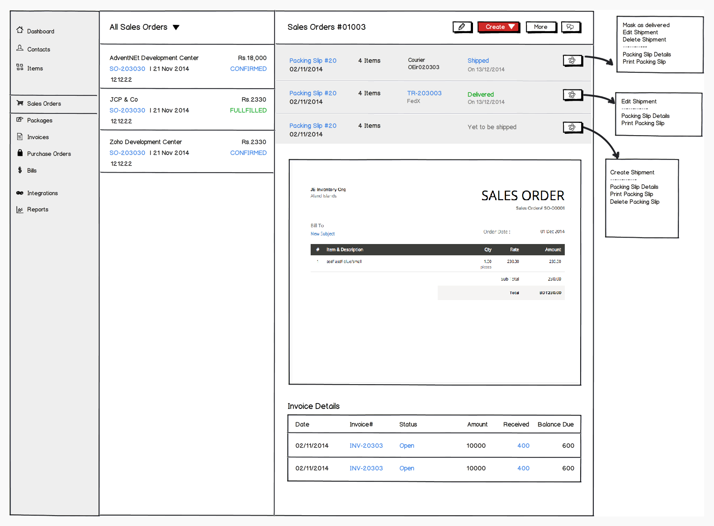
*Wireframe showing sales order details layout planning*

### Patterns Worth Emulating

| Product | Pattern | Adaptation for Cold Storage |
|---------|---------|----------------------------|
| TallyPrime | "Go To" search | Global command palette |
| Zoho Books | Clean dashboard cards | KPI widgets with drill-down |
| Vyapar | Mobile-first invoicing | Chitti generation on phone |
| QuickBooks | Automated bank feeds | Auto-reconciliation suggestions |
| Odoo | Modular apps | Role-based module access |

### Patterns to Improve Upon

| Product | Issue | Our Approach |
|---------|-------|--------------|
| TallyPrime | Dense, dated UI | Modern, spacious design |
| Zoho | Feature overload | Progressive disclosure |
| Vyapar | Limited for complex operations | Scalable complexity |
| QuickBooks | Slow page loads | SPA architecture |
| Busy | Confusing GST handling | Guided GST workflows |

---

## Appendix B: User Persona Considerations

### Primary Persona: Cold Storage Operator
- **Technical Skill**: Low to medium
- **Key Tasks**: Amad, Nikasi, Chitti, Daily reporting
- **Pain Points**: Data entry speed, finding party info, Hindi input
- **Goals**: Complete tasks quickly, avoid errors, go home on time

### Secondary Persona: Owner/Manager
- **Technical Skill**: Medium
- **Key Tasks**: Dashboard review, party balance, reports
- **Pain Points**: Getting accurate summaries, settlement calculation
- **Goals**: Business overview, cash flow visibility, compliance

### Tertiary Persona: Accountant
- **Technical Skill**: High (accounting)
- **Key Tasks**: Vouchers, ledgers, settlement, GST
- **Pain Points**: Reconciliation, interest calculation, audit trails
- **Goals**: Accuracy, compliance, clean books

---

## Appendix C: Glossary of UI/UX Terms

| Term | Definition |
|------|------------|
| **Progressive Disclosure** | Showing advanced options only when user needs them |
| **Cognitive Load** | Mental effort required to use an interface |
| **Affordance** | Visual cues that suggest how to interact with an element |
| **Information Hierarchy** | Organizing content by importance |
| **F-Pattern** | Natural eye movement pattern when scanning screens |
| **Command Palette** | Text-based interface to access any feature by typing |
| **SPA** | Single Page Application - no full page reloads |
| **PWA** | Progressive Web App - web app with native-like features |

---

*Document prepared based on analysis of TallyPrime, Zoho Books, Zoho Inventory, Vyapar, Busy, QuickBooks, Odoo, NetSuite, and domain-specific cold storage solutions including Visual Softech CAP, Daksh ERP, PALMS, and Improsys WMS.*

*Last updated: January 2026*

---

## Appendix D: Image Sources & Attribution

All images used in this document are sourced from official product documentation and design resources for educational and research purposes.

### ERP/Accounting Software Screenshots

| Image | Source | URL |
|-------|--------|-----|
| TallyPrime Dashboard | TallyHelp | [help.tallysolutions.com](https://help.tallysolutions.com/dashboard/) |
| TallyPrime Sales/Add Tiles | TallyHelp | [help.tallysolutions.com](https://help.tallysolutions.com/dashboard/) |
| Zoho Books Dashboard | Zoho Books Help | [zoho.com/books/help](https://www.zoho.com/us/books/help/home/) |
| Zoho Inventory Design | Zoho Blog | [zoho.com/blog](https://www.zoho.com/blog/inventory/zoho-inventory-ui-ux-design-process.html) |
| Vyapar App | Vyapar | [vyaparapp.in](https://vyaparapp.in/) |
| QuickBooks Dashboard | Coupler.io | [coupler.io](https://www.coupler.io/dashboard-examples/quickbooks-dashboard) |

### Cold Storage & WMS Screenshots

| Image | Source | URL |
|-------|--------|-----|
| Cold WMS Dashboard | Improsys | [improsys.in](https://www.improsys.in/cold-wms.htm) |
| Cold WMS Inventory | Improsys | [improsys.in](https://www.improsys.in/cold-wms.htm) |
| Cold WMS Temperature | Improsys | [improsys.in](https://www.improsys.in/cold-wms.htm) |
| Cold WMS Billing | Improsys | [improsys.in](https://www.improsys.in/cold-wms.htm) |

### Design Pattern References

| Image | Source | URL |
|-------|--------|-----|
| Dashboard Design Principles | UXPin | [uxpin.com](https://www.uxpin.com/studio/blog/dashboard-design-principles/) |
| Analytical Dashboard | UXPin | [uxpin.com](https://www.uxpin.com/studio/blog/dashboard-design-principles/) |
| Operational Dashboard | UXPin | [uxpin.com](https://www.uxpin.com/studio/blog/dashboard-design-principles/) |
| ERP UI Best Practices | AorBorC | [aorborc.com](https://www.aorborc.com/10-best-practices-for-erp-app-ui-design/)
